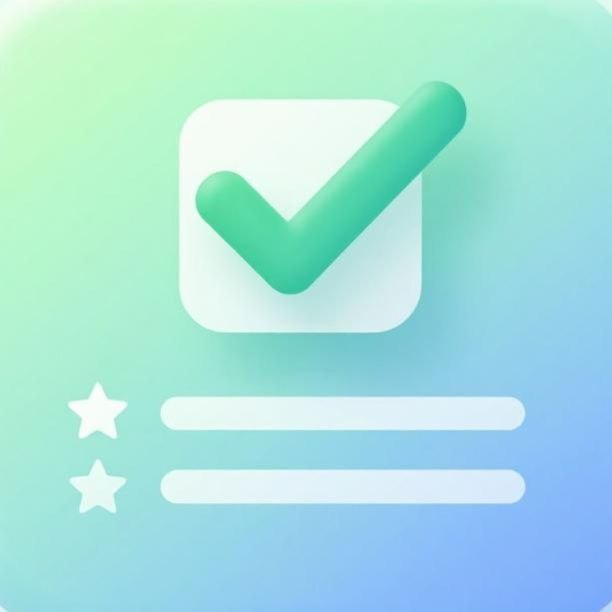
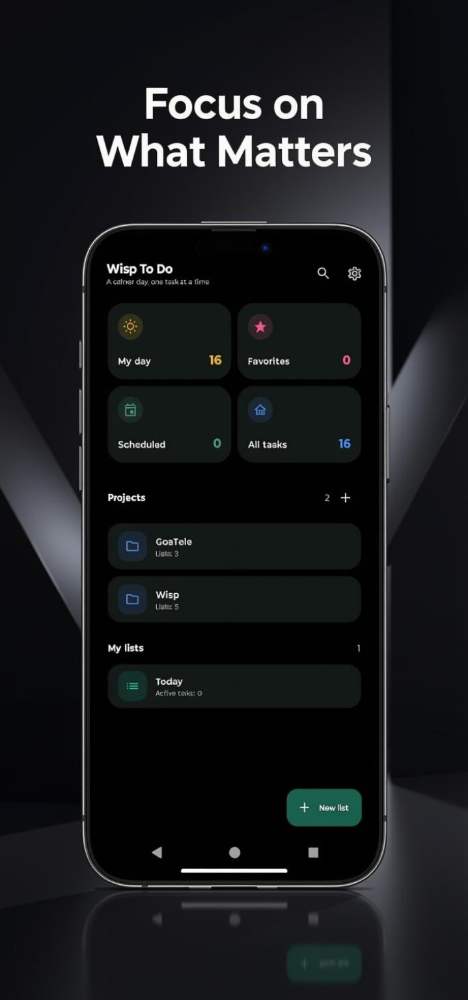
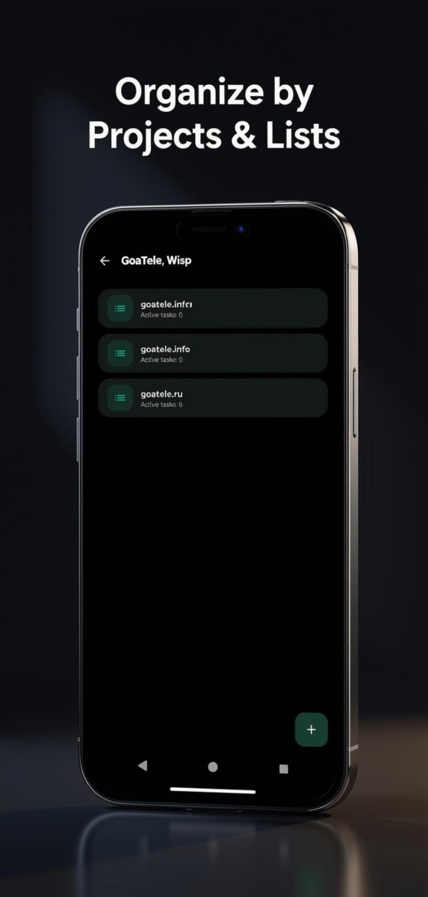
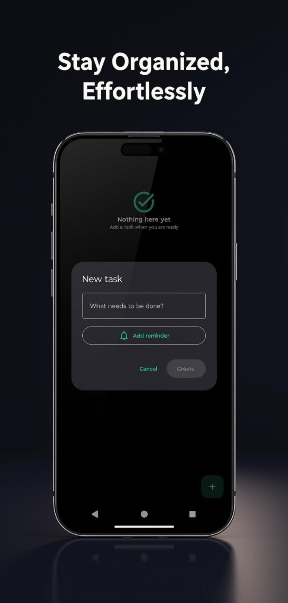
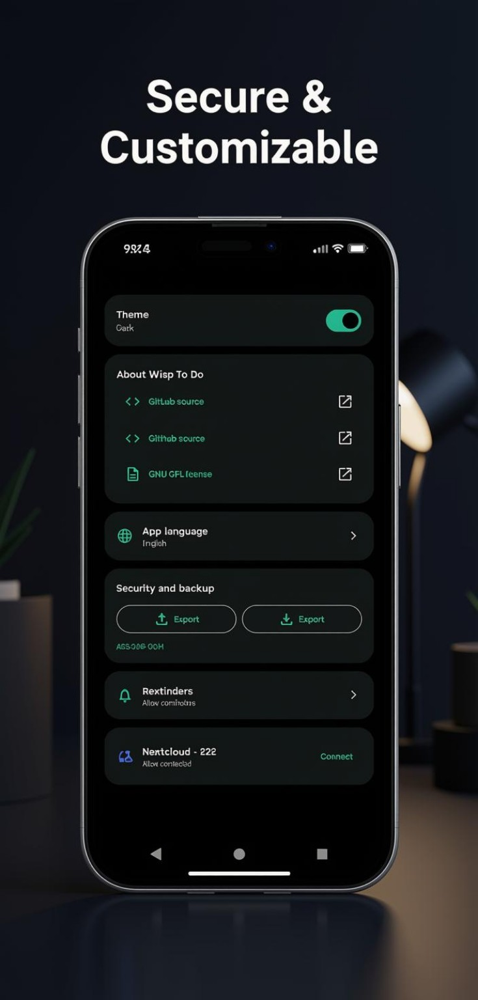

<p align="center">
  
</p>

<h1 align="center">Wisp To Do</h1>

<p align="center">
  A calm day, one task at a time.
  <br>
  An open-source Android task manager for projects, lists, reminders, and encrypted backups.
</p>

<p align="center">
  <a href="https://gitlab.com/wispapps/wisp-to-do">GitLab source</a> ·
  <a href="https://github.com/WispApps/wisp-to-do">GitHub source</a> ·
  <a href="https://www.gnu.org/licenses/gpl-3.0.html">GPL-3.0-or-later</a>
</p>

<p align="center">
  
  
  
</p>

## Preview

These are promotional UI mockups. They illustrate the app's visual direction and may differ from the current Android build.

<table>
  <tr>
    <td align="center"><br><b>Today at a glance</b></td>
    <td align="center"><br><b>Projects and lists</b></td>
  </tr>
  <tr>
    <td align="center"><br><b>Tasks and reminders</b></td>
    <td align="center"><br><b>Settings and backup</b></td>
  </tr>
</table>

## Features

- Organize work into projects, lists, and tasks.
- Find tasks and lists with search; mark important tasks as favorites.
- Set date-and-time reminders and receive Android notifications when permitted.
- Choose a light or dark theme and use the interface in multiple languages.
- Export and import an encrypted archive protected by your recovery phrase.
- Create an encrypted backup to a user-configured Nextcloud server.

Nextcloud support is a manual encrypted backup and restore feature; it is not continuous two-way synchronization.

## Privacy and data

Task data is stored by the app on the device. Exported archives and Nextcloud backup files are encrypted with AES-256-GCM and protected using the recovery phrase. Keep the phrase safe: it is needed to restore an archive and cannot be recovered by the project maintainers.

The app requests Android notification permission when needed. File import and export use Android's system document picker so the user chooses the specific file.

## Build from source

### Requirements

- Android Studio
- JDK 17 or newer
- Android SDK Platform 35

### Build a debug APK

On Windows PowerShell:

```powershell
.\gradlew.bat assembleDebug
```

The APK is created at `app/build/outputs/apk/debug/app-debug.apk`.

On Linux or macOS:

```bash
./gradlew assembleDebug
```

To install on a connected Android device with USB debugging enabled, run `installDebug` in the corresponding command line.

## Languages

The interface includes English, German, Spanish, French, Italian, Dutch, Polish, Portuguese, Russian, and Ukrainian.

## Source and license

Wisp To Do is free software licensed under the [GNU General Public License, version 3 or later](LICENSE). The full license text is included in this repository. Read more on the [GNU licenses website](https://www.gnu.org/licenses/).

- [GitLab organization: WispApps](https://gitlab.com/wispapps)
- [GitLab repository: Wisp To Do](https://gitlab.com/wispapps/wisp-to-do)
- [GitHub organization: WispApps](https://github.com/WispApps)
- [GitHub repository: Wisp To Do](https://github.com/WispApps/wisp-to-do)

## Artwork

The app icon was generated using Lumo 2.0 by Proton AG. See [ARTWORK.md](ARTWORK.md) for the available provenance details.
